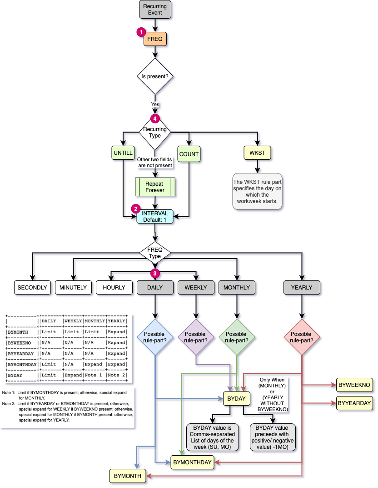

# rrule 

A dart library to process rrule field in google calendar, according to iCalendar RFC5545 specifications.  

## Workflow Diagram

## Usage 
TODO

## PENDING TASKS
1) Add BYSETPOS  
2) Yearly Strategy: BYWEEKNO, BYYEARDAY  
3)

